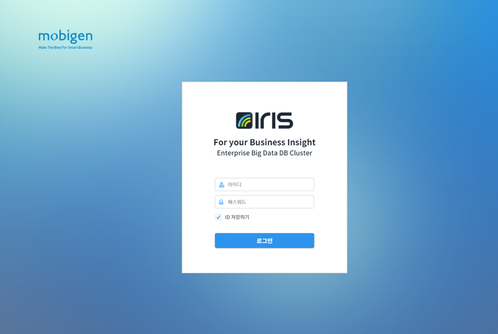
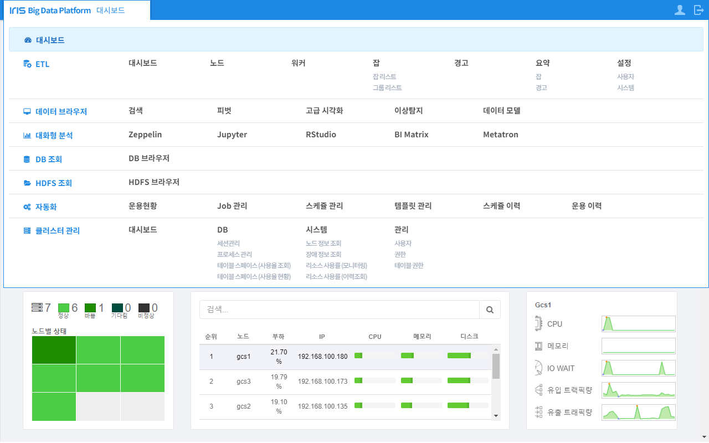
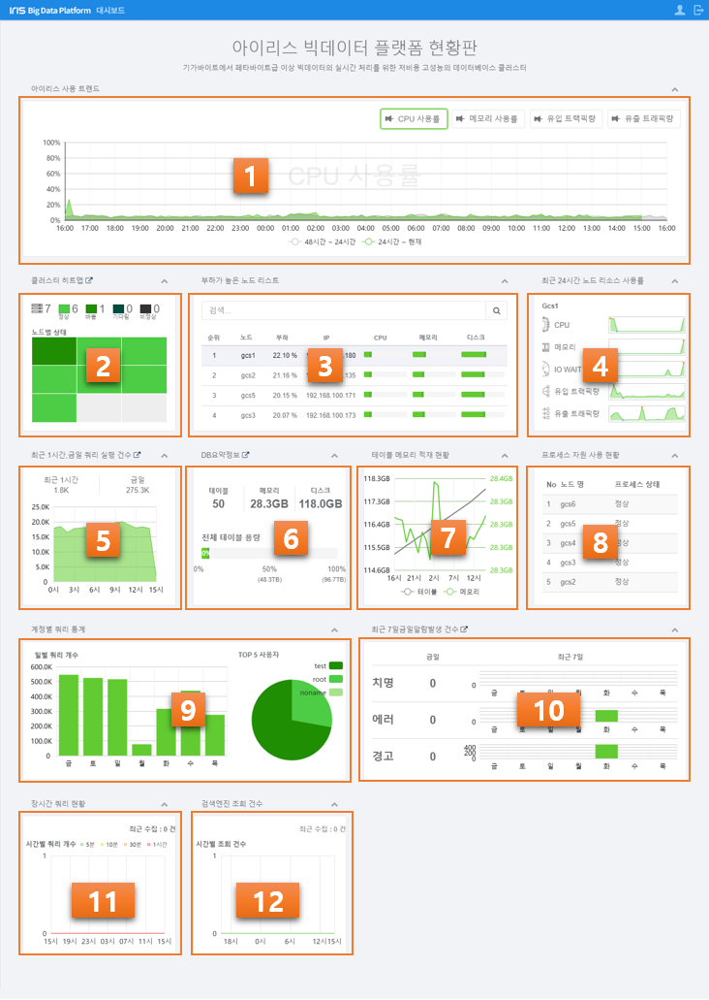

B-IRIS Overview
=================

`Document History 3 <#document-history>`__

`1 개요 4 <#개요>`__

**1.1** **About this document** 4

`2 Getting started 6 <\l>`__

`2.1 시스템 요구사항 6 <#시스템-요구사항>`__

`2.2 로그인 6 <#로그인>`__

`2.3 홈 화면의 구조 8 <#대시보드-화면의-구조>`__

`3 검색 9 <#_Toc463276579>`__

`3.1 활용 팁 9 <#_Toc463276580>`__

`3.2 검색 화면 9 <#_Toc463276581>`__

`3.3 검색기간 설정하기 11 <#_Toc463276582>`__

`3.4 이벤트 검색 및 분석하기 13 <#_Toc463276583>`__

`3.4.1 이벤트 검색하기 13 <#_Toc463276584>`__

`3.4.2 검색 결과 분석하기: 이벤트 탭 15 <#_Toc463276585>`__

`3.4.3 이벤트 리스트 활용하기 16 <#_Toc463276586>`__

`3.4.4 검색 결과 분석하기: 통계 탭 및 시각화 탭 18 <#_Toc463276587>`__

`3.4.5 검색결과에서 재검색/보고서 이용하기 21 <#_Toc463276588>`__

`4 피벗을 사용한 분석 24 <#_Toc463276589>`__

`4.1 피벗화면 사용하기 24 <#_Toc463276590>`__

`4.2 피벗 설정하기 26 <#_Toc463276591>`__

`4.2.1 피벗 테이블 설정하기 26 <#_Toc463276592>`__

`4.2.2 피벗 차트 설정하기: 세로막대형 37 <#_Toc463276593>`__

`4.2.3 피벗 차트 설정하기: 막대형 46 <#_Toc463276594>`__

`4.2.4 피벗 차트 설정하기: 꺾은 선형 54 <#_Toc463276595>`__

`4.2.5 피벗 차트 설정하기: 원형 60 <#_Toc463276596>`__

`5 보고서 68 <#_Toc463276597>`__

+----------------------------------+
| .. rubric:: **Document History** |
|    :name: document-history       |
+----------------------------------+

+------------+--------+------+----------------+----------------+
| 수정날짜   | 작성자 | 버전 | 추가/수정 항목 | 내 용          |
+------------+--------+------+----------------+----------------+
| 2017-07-27 | 류준석 | 1.0  |                | 초기 버전 작성 |
+------------+--------+------+----------------+----------------+
|            |        |      |                |                |
+------------+--------+------+----------------+----------------+
|            |        |      |                |                |
+------------+--------+------+----------------+----------------+
|            |        |      |                |                |
+------------+--------+------+----------------+----------------+
|            |        |      |                |                |
+------------+--------+------+----------------+----------------+
|            |        |      |                |                |
+------------+--------+------+----------------+----------------+

+----------------------+
| .. rubric:: **개요** |
|    :name: 개요       |
+----------------------+

**About this document**
-----------------------

본 문서는 IRIS 로그분석기(version 1.0)의 사용자에게 제공되는 각 기능의
사용 방법을 기술하고 있습니다. IRIS 로그분석기는 IRIS DB에 저장된 각종
로그 데이터로부터 특정 키워드를 검색하거나 통계 분석할 수 있는 환경을
제공합니다. 사용자는 시스템의 고장 탐지는 물론, 보안 모니터링, 고객 패턴
분석 등 다양한 분야에서 IRIS 로그분석기를 활용할 수 있습니다. IRIS
로그분석기에서 제공되는 기본 기능은 다음과 같습니다.

+-----------------------------------+-----------------------------------+
| 기능                              | 설명                              |
+===================================+===================================+
| 검색                              | IRIS DB에 저장된 대량의 데이터    |
|                                   | 중, 특정 키워드(숫자, 문자, 단어, |
|                                   | 문장 등)가 포함된 이벤트를        |
|                                   | 고속으로 검색하며, 통계 및 차트를 |
|                                   | 통해 비정상 상황을 분석할 수 있는 |
|                                   | 기능을 제공합니다.                |
+-----------------------------------+-----------------------------------+
| 피벗                              | 분석하고자 하는 데이터를 사용자가 |
|                                   | 임의대로 정렬하고 필터링          |
|                                   | 함으로써, 보다 빠르고 쉽게        |
|                                   | 데이터를 분석할 수 있는 피벗      |
|                                   | 기능을 제공합니다.                |
+-----------------------------------+-----------------------------------+
| 보고서                            | 검색 및 피벗 조건을 저장하여      |
|                                   | 주기적으로 재사용하거나, 다른     |
|                                   | 사용자와 공유할 수 있는 보고서    |
|                                   | 기능을 제공합니다.                |
+-----------------------------------+-----------------------------------+

본 문서는 다음과 같이 구성되어 있습니다.

**Chapter 1** – **개요**

본 문서의 구성에 대하여 개략적으로 소개하였습니다.

**Chapter 2** – **Getting started**

IRIS 로그 분석기의 기능을 사용하기 위한 시스템 요구사항, 로그분석 홈
화면의 로그인 절차, 화면의 구조 등에 대하여 소개하였습니다.

**Chapter 3** – **검색**

검색하고자 하는 숫자 혹은 텍스트 등으로 구성된 키워드를 입력하여 원하는
이벤트를 검색하고, 통계 및 차트를 통하여 비정상 상황과 원인을 분석할 수
있는 검색 기능에 대한 상세한 사용 방법을 소개하였습니다.

**Chapter 4** – **피벗을 사용한 분석**

사용자가 피벗 기능을 활용하여 데이터를 다양한 각도에서 분석할 수 있는
GUI에 대한 상세한 사용 방법을 소개하였습니다.

**Chapter 5** – **보고서**

상기 검색 및 피벗 기능에서 사용된 검색 조건의 템플릿을 재사용하거나,
다른 사용자와 공유하기 위하여, 기존 템플릿을 저장하고 관리하는 방법을
소개하였습니다.

+---------------------------------+
| .. rubric:: **Getting started** |
|    :name: getting-started       |
+---------------------------------+

**시스템 요구사항**
-------------------

IRIS 로그 분석기를 사용하기 위하여 필요한 기본적인 시스템 환경에 대한
요구사항은 아래와 같습니다. 하드웨어는 제약이 없으며, 아래의
소프트웨어가 동작하여야 합니다.

+-----------------------+-----------------------+-----------------------+
| 구분                  | 요구사항              | 비고                  |
+=======================+=======================+=======================+
| 소프트웨어            | IRIS 로그 분석기의 각 |                       |
|                       | 기능은 IRIS DB v1.5   |                       |
|                       | 및 Spark 1.6에서      |                       |
|                       | 동작합니다. IRIS DB와 |                       |
|                       | Spark의 설치를        |                       |
|                       | 위해서는 IRIS DB      |                       |
|                       | Installation Guide를  |                       |
|                       | 참조하기 바랍니다.    |                       |
+-----------------------+-----------------------+-----------------------+
| 웹 브라우저           | IRIS 로그 분석기는    |                       |
|                       | IE10+, Chrome,        |                       |
|                       | FireFox 등 모던       |                       |
|                       | 브라우저를 지원하며,  |                       |
|                       | Chrome 브라우저의     |                       |
|                       | 사용을 권장합니다.    |                       |
+-----------------------+-----------------------+-----------------------+
| 화면 해상도           | IRIS 로그 분석기의    |                       |
|                       | 화면은 1280 x 800     |                       |
|                       | 해상도에 최적화되어   |                       |
|                       | 있습니다.             |                       |
+-----------------------+-----------------------+-----------------------+

**로그인**
----------

사용자는 아래와 같은 절차에 따라 IRIS 로그 분석 홈 화면에 접속할 수
있습니다.

1. 상기에 지원되는 웹 브라우저를 실행하여 다음 URL을 입력하면 IRIS 로그
   분석 웹에 접속하기 위한 로그인 화면이 오픈 됩니다.

..

   |image0|

2. 상기 로그인 화면에서, 아래 제시한 ID와 패스워드를 입력하면 IRIS 통합
   화면으로 연결됩니다.

..

   username: demo2

   password: demo2

   ※ 아래 IRIS 통합 화면에서 현황판, 클러스터 관리, DB 조회, 대화형 분석
   등은 IRIS DB와 관련된 기능이므로, 자세한 내용은 IRIS DB UI 사용자
   가이드를 참조하기 바랍니다.

3. IRIS 통합 화면에서 데이터브라우저의 메뉴를 클릭하여 오픈된 로그분석
   홈 화면(이하 “홈 화면”)에서 로그 분석 기능을 사용할 수 있습니다.

..

   |image1|

**대시보드 화면의 구조**
------------------------

대시보드 화면은 사용자가 한눈에 시스템의 정보를 볼 수 있는 직관적인
사용자 인터페이스를 제공합니다. 아래에 대시보드 화면의 구조와 각 기능에
대하여 소개하였습니다.

   |image2|

+-----------------------+-----------------------+-----------------------+
| 번호                  | 구분                  | 설명                  |
+=======================+=======================+=======================+
| |/Users/Yongs/Downloa | 아이리스 사용 트렌드  | 어제와 오늘의 CPU     |
| ds/DB                 |                       | 사용률, 메모리        |
| 브라우저          |                       | 사용률, 유입 유출     |
| 그림파일/1.png| |                       | 트래픽량을 비교해서   |
|                       |                       | 볼수 있습니다.        |
|                       |                       | |image16|\ 을         |
|                       |                       | 클릭해서 여러 개를    |
|                       |                       | 동시에 볼 수          |
|                       |                       | 있습니다.             |
+-----------------------+-----------------------+-----------------------+
| |/Users/Yongs/Downloa | 클러스터 히트맵       | 아이리스 클러스터의   |
| ds/DB                 |                       | 정보를 히트맵         |
| 브라우저          |                       | 형식으로 보여줍니다.  |
| 그림파일/2.png| |                       | 노드별 상태를         |
|                       |                       | 클릭하면 해당 노드    |
|                       |                       | 정보 화면으로         |
|                       |                       | 넘어갑니다.           |
+-----------------------+-----------------------+-----------------------+
| |/Users/Yongs/Downloa | 노드 리스트(부하순)   | 부하가 높은 노드      |
| ds/DB                 |                       | 순으로 정렬하여       |
| 브라우저          |                       | 노드의 부하 정보를    |
| 그림파일/3.png| |                       | 보여줍니다. 클릭시    |
|                       |                       | |/Users/Yongs/Downloa |
|                       |                       | ds/DB                 |
|                       |                       | 브라우저          |
|                       |                       | 그림파일/4.png|\ 에 |
|                       |                       |                       |
|                       |                       | 해당 노드의 리소스    |
|                       |                       | 사용률을 보여줍니다.  |
+-----------------------+-----------------------+-----------------------+
| |/Users/Yongs/Downloa | 노드 리소스 사용률    | 최근 24시간 동안      |
| ds/DB                 |                       | 리소스 사용률을       |
| 브라우저          |                       | 보여줍니다. 추세를    |
| 그림파일/4.png| |                       | 보여주는 차트로 위에  |
|                       |                       | 마우스를 올리면 min,  |
|                       |                       | max값과 해당 값을     |
|                       |                       | 보여줍니다.           |
+-----------------------+-----------------------+-----------------------+
| |image17|             | 쿼리 실행 건수        | 최근 1시간, 금일      |
|                       |                       | 실행된 쿼리 실행      |
|                       |                       | 건수를 보여줍니다.    |
+-----------------------+-----------------------+-----------------------+
| |/Users/Yongs/Downloa | DB 요약 정보          | 테이블의 개수,        |
| ds/DB                 |                       | 메모리, 디스크의      |
| 브라우저          |                       | 사용량을 보여줍니다.  |
| 그림파일/6.png| |                       |                       |
+-----------------------+-----------------------+-----------------------+
| |../Downloads/DB%20브 | 테이블 적재 현황     | 테이블의 디스크,      |
| 라우저%20그림파일/7 |                | 메모리의 적재 현황을  |
| .png|                 |                       | 보여줍니다.           |
+-----------------------+-----------------------+-----------------------+
| |../Downloads/DB%20브 | 프로세스 자원 사용   | 프로세스 상태를       |
| 라우저%20그림파일/8 |                | 보여줍니다.           |
| .png|                 |                       |                       |
+-----------------------+-----------------------+-----------------------+
| |../Downloads/DB%20브 | 계정별 쿼리 통계     | 일별 쿼리 개수와 top  |
| 라우저%20그림파일/9 |                | 5 사용자를            |
| .png|                 |                       | 보여줍니다.           |
+-----------------------+-----------------------+-----------------------+
| |../Downloads/DB%20브 | 알람 발생 건수       | 금일 및 최근 7일간    |
| 라우저%20그림파일/1 |                | 알람 발생 건수를      |
| 0.png|                |                       | 보여줍니다.           |
+-----------------------+-----------------------+-----------------------+
| |../Downloads/DB%20브 | 장시간 쿼리 현황     | 장시간(5, 10, 30,     |
| 라우저%20그림파일/1 |                | 60분 단위) 실행되고   |
| 1.png|                |                       | 있는 쿼리의 개수를    |
|                       |                       | 보여줍니다.           |
+-----------------------+-----------------------+-----------------------+
| |../Downloads/DB%20브 | 검색엔진 조회 건수   | 검색 엔진에서 조회한  |
| 라우저%20그림파일/1 |                | 건수를 보여줍니다.    |
| 2.png|                |                       |                       |
+-----------------------+-----------------------+-----------------------+

.. |/Users/Yongs/Downloads/DB 브라우저 그림파일/2.png| image:: media/image6.png
   :width: 0.17708in
   :height: 0.15694in

.. |image8| image:: media/image9.tiff
   :width: 0.18056in
   :height: 0.15625in

.. |image17| image:: media/image9.tiff
   :width: 0.18056in
   :height: 0.15625in
